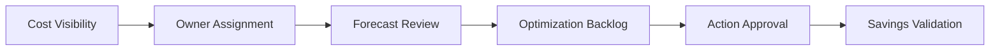

# FinOps Operating Model

## Purpose

The operating model defines how finance, engineering, and platform teams work together to manage cloud spend.

## Roles

- finance partner
- FinOps lead
- platform owner
- application owner
- executive sponsor

## Operating Flow

## Operating Cadence

1. Weekly or biweekly cost review
2. Monthly forecast review
3. Monthly optimization backlog review
4. Quarterly leadership review

## Operating Practices

- review actuals versus forecast
- prioritize top spend drivers
- approve and track optimization actions
- validate savings after changes
- refresh budget assumptions regularly

## Success Indicators

- predictable spend trends
- fewer unexplained variances
- visible optimization backlog
- clear ownership for high-cost areas

## Operating Notes

- finance and engineering should review together
- cost reviews should always produce an action list
- savings should be revalidated after the change lands
- every major spend driver should have an owner

## Use

Use this page to explain how cost decisions move from visibility to action across finance and engineering.

## Operating Outcome

The operating model should make it easy for finance and engineering to act on the same information set.

## Outcome

A good operating model turns cloud spend into a shared operational responsibility.
